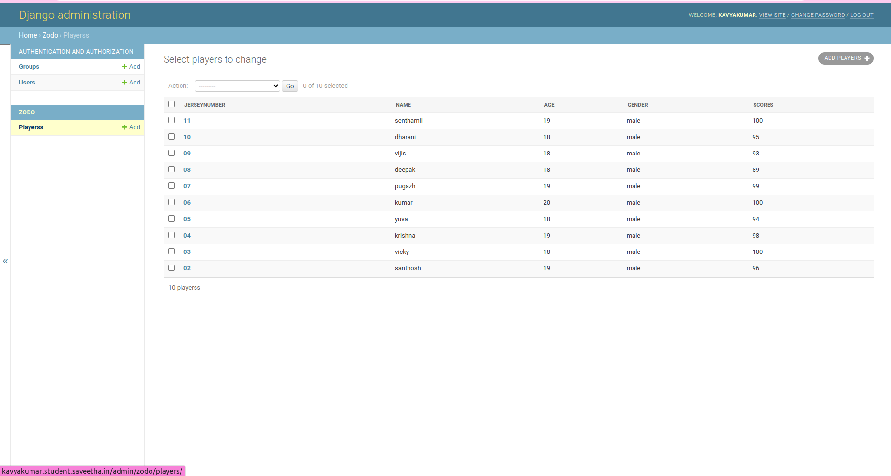

# Django ORM Web Application

## AIM
To develop a Django application to store and retrieve data from a database using Object Relational Mapping(ORM).

## Entity Relationship Diagram

## DESIGN STEPS

from django.db import models

### STEP 1:
class Players(models.Model):

### STEP 2:
from django.contrib import admin
### STEP 3:
print the result

## PROGRAM
## model.py
from django.db import models
from django.contrib import admin
class Players(models.Model):
    jerseynumber=models.CharField(max_length=10,primary_key=True)
    name=models.CharField(max_length=100)
    age=models.IntegerField()
    gender=models.CharField(max_length=100)
    scores=models.IntegerField()
class PlayersAdmin(admin.ModelAdmin):
    list_display=('jerseynumber','name','age','gender','scores')
## admin.py
from django.contrib import admin

from .models import Players,PlayersAdmin
# Register your models here.

admin.site.register(Players,PlayersAdmin)

## OUTPUT

## RESULT
Thus a Django application is successfully developed to store and retrieve data from a database using Object Relational Mapping(ORM).